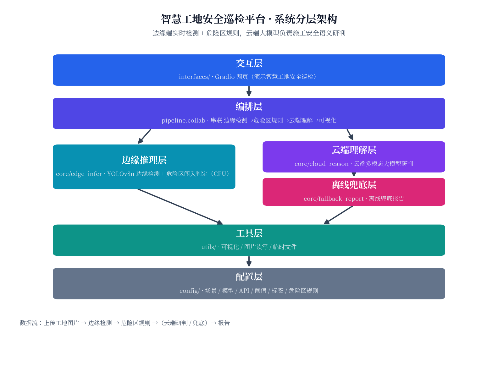
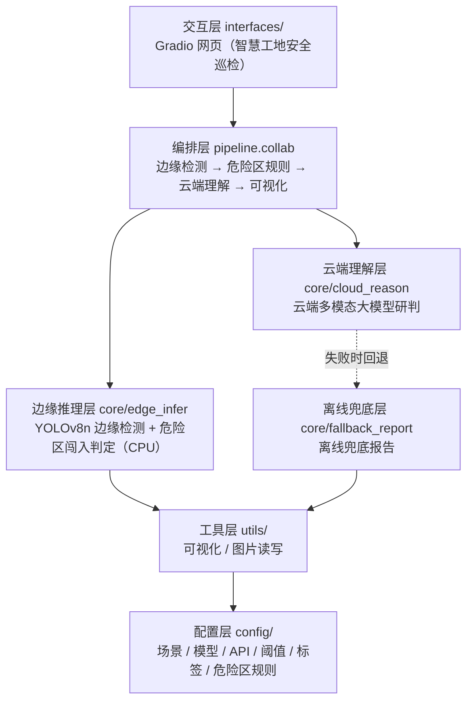

# 智慧工地安全巡检平台 · 端云协同 AI 推理应用（智算方向）

基于 **边缘端 YOLOv8 轻量推理 + 云端多模态大模型理解** 的跨域协同施工安全巡检原型，面向移动云 AI Coding 大赛「智算方向」（跨域协同 / 模型推理优化）。

本地边缘端只跑轻量检测（CPU 即可），并对"危险作业区"做实时规则化闯入预警；深度语义研判由云端大模型完成，二者协同构成"端云协同推理"。

---

## 一、场景定位：智慧工地安全巡检

把通用视觉推理**深耕到工地安全这一个垂直领域**，解决真实生产痛点：

- 边缘端实时识别**作业人员、工程运输车、通勤车辆**等要素；
- 画面中圈定一块**危险作业区**（如吊装/深基坑/临边区域），人员或车辆闯入即**实时标红预警**；
- 云端大模型把"看到的结果"写成可执行的**《施工安全巡检报告》**（现场概况 / 隐患研判 / 整改建议 / 处置结论）。

> 这正是智算方向倡导的"**跨域协同**"：边缘侧负责便宜、快速、隐私友好的感知，云端侧负责昂贵的深度语义理解，算力在端云之间合理分工。

---

## 二、总体架构（分层解耦 · 端云协同）



> 架构图由 `tools/generate_architecture.py` 生成（可复现）：`python tools/generate_architecture.py`



**核心设计思想：边缘感知与云端研判解耦。**
边缘端 YOLO 负责"看得准"（精确计数、画框、危险区规则），云端大模型负责"说得清"（语义理解、报告撰写），二者通过统一的 `detections` 数据结构衔接，可独立替换升级。

## 三、目录结构

```
edge_cloud_infer/
├── config/                 # 配置层
│   └── settings.py         # 场景 / 模型 / API / 阈值 / 标签映射 / 危险区规则
├── core/                   # 核心能力层
│   ├── edge_infer.py        # 边缘推理层：YOLOv8n 本地检测 + 危险区闯入判定
│   ├── cloud_reason.py       # 云端理解层：云端多模态大模型研判
│   └── fallback_report.py    # 离线兜底层：本地兜底报告（无 Key 时）
├── utils/                  # 工具层
│   ├── visualize.py         # 检测框 / 危险区绘制
│   └── imgio.py             # 图片读写 / 临时文件
├── pipeline/               # 编排层
│   └── collab.py            # 统一巡检入口：边缘检测→危险区→云端理解→可视化
├── interfaces/             # 交互层
│   └── web.py              # Gradio 网页 Demo
├── tests/                  # 测试
│   └── test_smoke.py       # 冒烟测试
├── tools/                  # 工具脚本
│   ├── backup_source.py     # 一键源码快照备份
│   └── generate_architecture.py  # 架构图生成
├── backups/                # 源码快照归档（按时间）
├── 参赛说明模板.md           # 比赛提交用
├── 提交指南.md              # git 提交/推送指引
├── requirements.txt
└── .env.example
```

## 四、各层职责

| 层 | 模块 | 职责 | 关键接口 |
|----|------|------|----------|
| 配置层 | `config/settings.py` | 场景、模型路径、置信度阈值、LLM 端点/密钥、中文标签、危险区规则 | 模块常量 |
| 边缘推理层 | `core/edge_infer.py` | 加载 YOLOv8n 检测；`check_danger_zone()` 判定危险区闯入 | `infer()` / `check_danger_zone()` |
| 云端理解层 | `core/cloud_reason.py` | 推理结果+原图送大模型，生成四段式施工安全报告 | `generate_report()` |
| 离线兜底层 | `core/fallback_report.py` | 无 Key / 调用失败时生成离线兜底报告，保证服务高可用 | `build_fallback_report()` |
| 工具层 | `utils/` | 可视化（含危险区橙框）、图片读写、临时文件 | `draw_detections()` |
| 编排层 | `pipeline/collab.py` | 串联各层，对外暴露单一巡检入口 | `analyze_image()` |
| 交互层 | `interfaces/web.py` | Gradio 网页：上传工地图→展示框图+危险区+报告 | `demo.launch()` |

## 五、数据流

```
上传工地图片
  │
  ▼ utils.imgio.numpy_to_tempfile()         落盘为临时 jpg
  │
  ▼ core.edge_infer.infer()                 YOLOv8n 边缘端检测 → detections（工地标签）
  │
  ▼ core.edge_infer.check_danger_zone()      危险作业区闯入判定 → intrusions
  │
  ├─► core.cloud_reason.generate_report()    推理结果 + 原图 → 云端大模型 → 《施工安全巡检报告》
  │      └─ 失败/无Key → core.fallback_report  离线兜底报告
  │
  ├─► utils.visualize.draw_detections()       原图 + 框 + 危险区 → 标注图（闯入标红）
  │
  ▼ 返回 (标注图路径, 报告文本, 概览) → 网页展示
```

## 六、运行步骤

1. 安装依赖：`pip install -r requirements.txt`
2. （可选）复制 `.env.example` 为 `.env` 并填入云端大模型密钥，启用云端研判：
   ```bash
   cp .env.example .env
   # 编辑 .env，填入 LLM_BASE_URL / LLM_API_KEY / LLM_MODEL
   ```
   不填也能跑 —— 会自动用本地兜底报告（离线兜底层）。
3. 启动：`python interfaces/web.py`
   浏览器打开终端给出的地址（默认 `http://localhost:7860`），上传工地图片点"开始巡检"。

> 首次运行会自动下载 `yolov8n.pt`（约 6MB）。

## 七、危险作业区规则（可配置）

在 `config/settings.py` 中：

```python
ENABLE_DANGER_ZONE = True                       # 是否启用危险区预警
DANGER_ZONE = (0.62, 0.12, 0.98, 0.62)          # 归一化矩形(x1,y1,x2,y2)，按监控画面调整
DANGER_ZONE_LABEL = "危险作业区"
ZONE_WATCH_CLASSES = {"person", "car", "truck", "bus", "motorcycle", "bicycle"}  # 受监管类别
```

标注图上危险区以**橙色框**标出，闯入目标以**红色框 + ⚠闯入**标出，巡检概览会给出"危险作业区闯入 N 起"的实时预警。

## 八、技术亮点（贴合智算方向）

- **跨域协同推理**：边缘端实时轻量检测 + 云端深度语义理解，分工协同，体现"跨域协同"。
- **模型推理优化**：边缘侧只用 YOLOv8n 轻量模型（CPU），重算力集中在云端 API，整体推理成本可控。
- **规则化安全监管**：边缘端叠加"危险作业区闯入"规则，零延迟实时预警，不依赖云端。
- **检测与理解解耦**：YOLO 精确计数画框，多模态大模型负责语义理解与报告撰写，两层可独立升级。
- **零训练**：直接复用 YOLOv8n 预训练权重，开箱即用。
- **高可用兜底**：无 Key 或云端调用失败自动降级到本地兜底，服务永不崩。

## 九、可扩展点（框架预留）

| 扩展方向 | 改动位置 |
|----------|----------|
| 接入专用模型（安全帽/反光衣检测） | 替换 `config.DETECTION_MODEL` 为工地专用权重 |
| 实时摄像头监控 | `interfaces/web.py` 增加 webcam 源，复用 `pipeline` |
| 支持短视频：按帧采样 + 时序汇总 | 新增 `pipeline/video.py` |
| 增加 API 接口供大屏调用 | 新增 `interfaces/api.py`（FastAPI） |
| 缓存 / 批处理加速 | `pipeline/collab.py` 中加入缓存与批量推理 |
