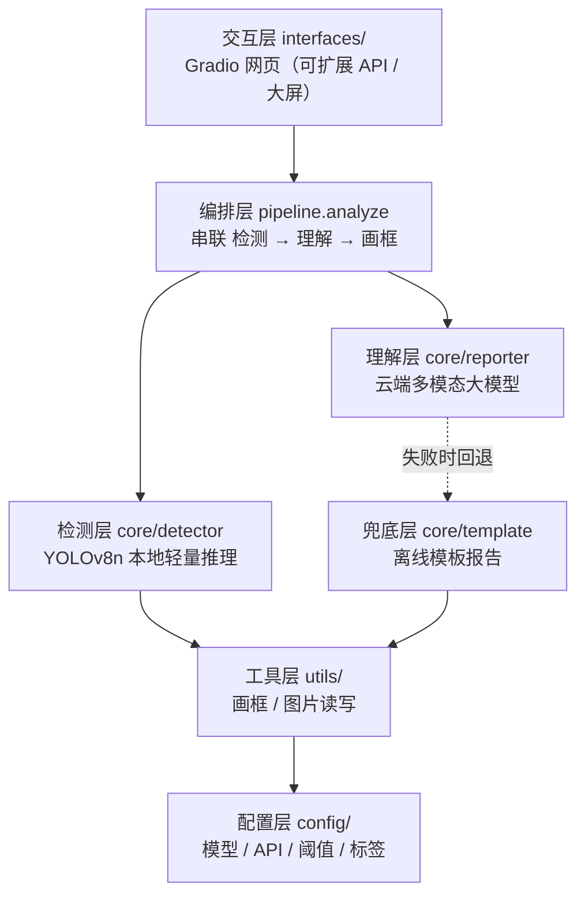

# 城市安全之眼 · 智慧城市 AI 分析（分层框架）

基于 **YOLOv8 轻量检测 + 云端多模态大模型** 的智慧城市安全分析原型。
本地只跑轻量检测（CPU 即可），智能报告由云端大模型生成（用比赛送的 Token）。

---

## 一、总体架构（分层解耦）


> 架构图由 `tools/generate_architecture.py` 生成（可复现）：`python tools/generate_architecture.py`



**核心设计思想：检测与理解解耦。**
YOLO 负责"看得准"（精确计数、画框），大模型负责"说得清"（语义理解、报告撰写），
两者通过统一的 `detections` 数据结构衔接，可独立替换升级。

## 二、目录结构

```
city_safety_eye/
├── config/                 # 配置层
│   └── settings.py         # 模型 / API / 阈值 / 中文标签映射
├── core/                   # 核心能力层
│   ├── detector.py         # 检测层：YOLOv8n 本地轻量推理
│   ├── reporter.py         # 理解层：云端多模态大模型报告
│   └── template.py         # 兜底层：本地模板报告（无 Key 时）
├── utils/                  # 工具层
│   ├── draw.py             # 检测框与标签绘制
│   └── imageio.py          # 图片读写 / 临时文件
├── pipeline/               # 编排层
│   └── analyze.py          # 统一分析入口：检测→理解→画框
├── interfaces/             # 交互层
│   └── web.py              # Gradio 网页 Demo
├── tests/                  # 测试
│   └── test_smoke.py       # 冒烟测试
├── legacy/                 # 原始 flat 版 Demo（归档，勿改）
├── 创作说明模板.md           # 比赛提交用
├── requirements.txt
└── .env.example
```

## 三、各层职责

| 层 | 模块 | 职责 | 关键接口 |
|----|------|------|----------|
| 配置层 | `config/settings.py` | 集中管理模型路径、置信度阈值、LLM 端点/密钥、中文标签映射 | 模块常量 |
| 检测层 | `core/detector.py` | 加载 YOLOv8n，对图片推理，输出中文标签+置信度+框坐标 | `detect(image_path) -> (detections, raw)` |
| 理解层 | `core/reporter.py` | 把检测结果+原图送大模型，生成四段式结构化报告 | `generate_report(detections, image_path) -> str` |
| 兜底层 | `core/template.py` | 无 Key / 调用失败时生成离线模板报告，保证 demo 始终可跑 | `build_template_report(detections) -> str` |
| 工具层 | `utils/` | 画框、图片读写、临时文件管理 | `draw_detections()`, `numpy_to_tempfile()` |
| 编排层 | `pipeline/analyze.py` | 串联三层，对外暴露单一分析入口 | `analyze_image(image) -> (out_path, report)` |
| 交互层 | `interfaces/web.py` | Gradio 网页：上传图片→展示画框图+报告 | `demo.launch()` |

统一数据契约（各层之间传递）：
```python
detections = [
    {"label_en": "car", "label_zh": "小汽车", "conf": 0.87, "box": [x1, y1, x2, y2]},
    ...
]
```

## 四、数据流

```
上传图片
  │
  ▼ utils.imageio.numpy_to_tempfile()      落盘为临时 jpg
  │
  ▼ core.detector.detect()                 YOLOv8n 推理 → detections
  │
  ├─► core.reporter.generate_report()      检测结果 + 原图 → 大模型 → 报告
  │      └─ 失败/无Key → core.template     兜底模板报告
  │
  ├─► utils.draw.draw_detections()         原图 + 框 → 标注图
  │
  ▼ 返回 (标注图路径, 报告文本) → 网页展示
```

## 五、运行步骤

1. 安装依赖：`pip install -r requirements.txt`
2. （可选）复制 `.env.example` 为 `.env` 并填入云端大模型密钥，启用专业报告：
   ```bash
   cp .env.example .env
   # 编辑 .env，填入 LLM_BASE_URL / LLM_API_KEY / LLM_MODEL
   ```
   不填也能跑 —— 会自动用本地模板报告（兜底层）。
3. 启动：`python interfaces/web.py`
   浏览器打开终端给出的地址（默认 `http://localhost:7860`），上传图片点"开始分析"。

> 首次运行会自动下载 `yolov8n.pt`（约 6MB）。

## 六、技术亮点（可用于答辩）

- **检测与理解解耦**：YOLO 精确计数画框，多模态大模型负责语义理解与报告撰写，两者可独立升级。
- **零训练**：直接复用 YOLOv8n 预训练权重，开箱即用。
- **互补识别**：YOLO 未覆盖的烟火 / 积水 / 违停，由多模态大模型看图补充。
- **高可用兜底**：无 Key 或云端调用失败自动降级到本地模板，demo 永不崩。
- **成本低**：本地无重模型，算力消耗集中在云端 API。

## 七、可扩展点（框架预留）

| 扩展方向 | 改动位置 |
|----------|----------|
| 支持短视频：按帧采样 + 时序汇总 | 新增 `pipeline/video.py`，复用 `core/detector.py` |
| 接入专用模型（烟火/积水/违停） | 扩展 `core/detector.py`，或新增 `core/special_detector.py` |
| 增加 API 接口供大屏调用 | 新增 `interfaces/api.py`（FastAPI），复用 `pipeline` |
| 升级为监测大屏 | 新增 `interfaces/dashboard.py` |
| 缓存 / 批处理加速 | `pipeline/analyze.py` 中加入缓存与批量推理 |
